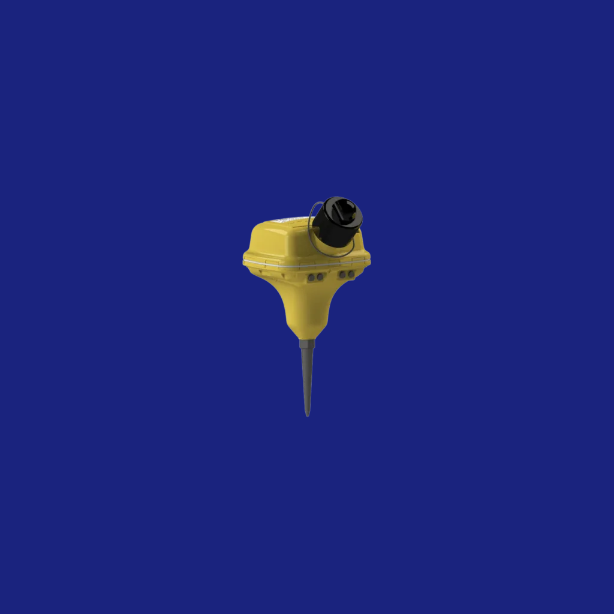
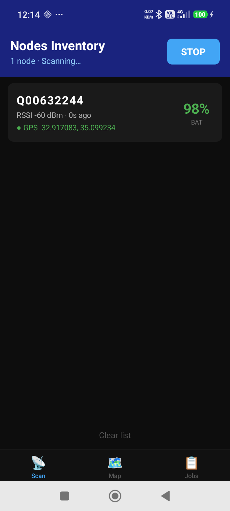
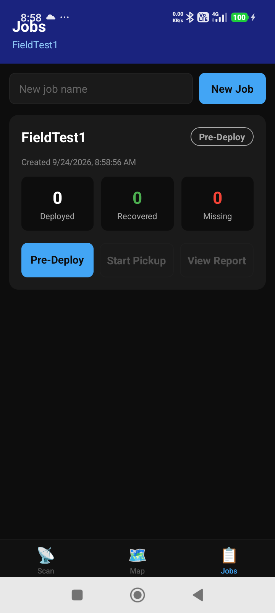
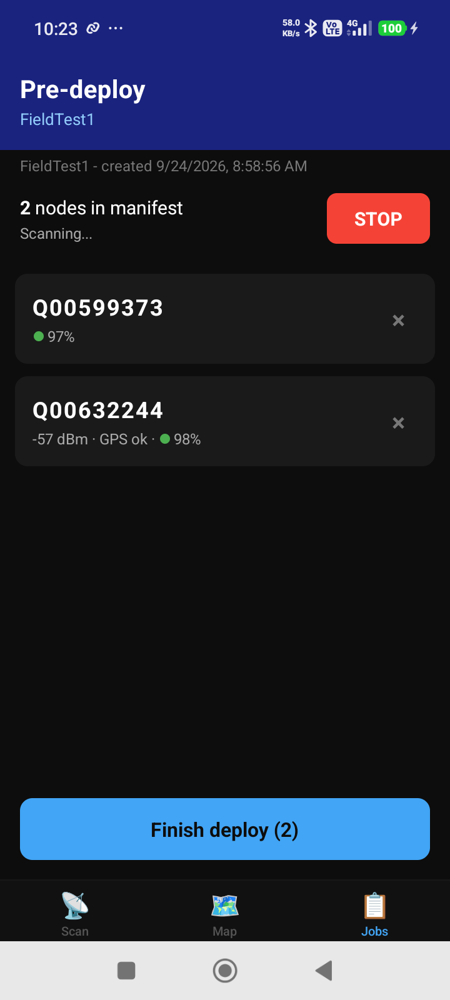
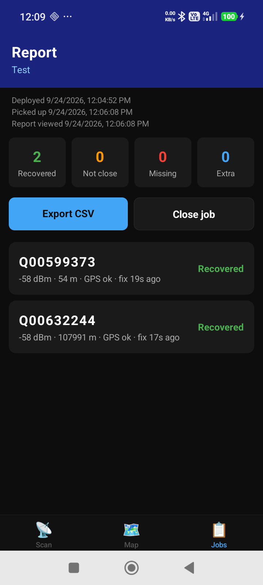
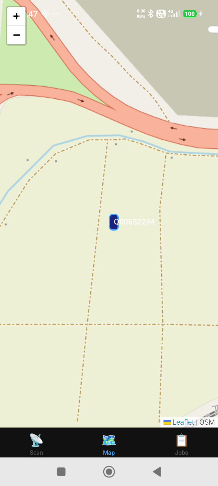
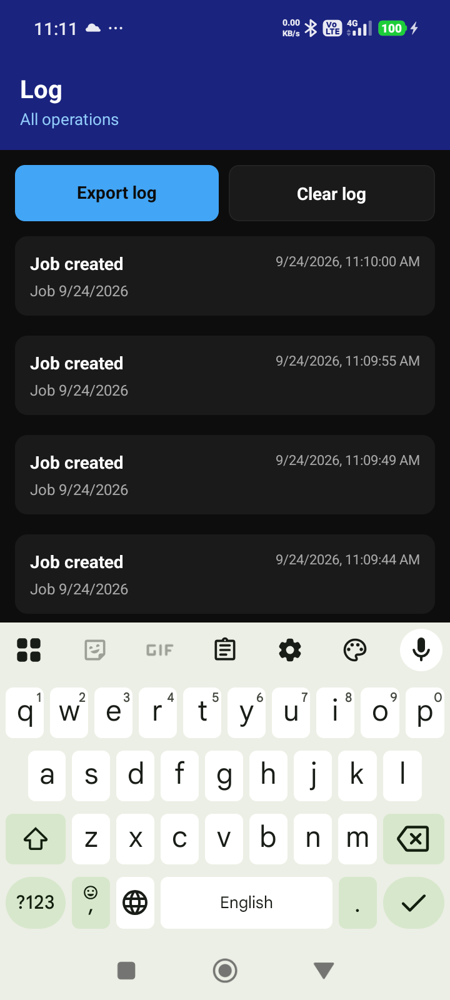

<div align="center">



# Nodes Inventory

**An Android field tool that tracks INOVA Quantum seismic nodes over Bluetooth Low Energy, from deploy to pickup.**


</div>

---

## What it does

Nodes Inventory passively listens over Bluetooth Low Energy for INOVA Quantum seismic nodes, which advertise under the name `TN <serial>`. For each node it hears, it decodes the Q-serial, battery level, signal strength (RSSI), and any GPS coordinates the node itself broadcasts. On top of that live feed it runs a deploy-and-pickup accounting workflow, scoped to a Job, so a crew can prove exactly which nodes went out to the field and which ones came back. The app is organized into three tabs: Scan, Map, and Jobs.

## Screenshots

<table>
  <tr>
    <td align="center"><br /><sub><b>Scan</b>: live BLE list</sub></td>
    <td align="center"><br /><sub><b>Jobs home</b>: status and counts</sub></td>
    <td align="center"><br /><sub><b>Pre-Deploy</b>: building the manifest</sub></td>
  </tr>
  <tr>
    <td align="center"><br /><sub><b>Report</b>: counts and per-node results</sub></td>
    <td align="center"><br /><sub><b>Map</b>: nodes that report GPS</sub></td>
    <td align="center"><br /><sub><b>Log</b>: append-only operations history</sub></td>
  </tr>
</table>

## Features

- **Live BLE scan.** Passively listens for Quantum nodes broadcasting nearby and lists each one with its Q-serial, RSSI, battery, and any GPS it reports.
- **Job-scoped deploy and pickup.** Every deployment cycle is a Job that moves through Pre-Deploy, Deployed, Pickup, and Closed.
- **BLE-based recovery.** During Pickup, a node is confirmed as recovered by its Bluetooth signal. A strong RSSI means the node is right there in the bag or cradle next to the phone. Recovery is not decided by GPS.
- **Per-node "Seen / Not seen" live feedback.** While you scan during Pickup, each node on the manifest updates in real time so you can watch the recovered count climb.
- **Map view.** Plots every node that reports coordinates as a pin on an OpenStreetMap background, rendered with Leaflet.
- **Append-only operations log.** Records job creation, status changes, deploy finished, node removed, reconcile results, CSV exports, and job deletions. Entries are added, never edited, so the log is an audit trail.
- **CSV report export.** Saves a per-job report to device storage with a filename built from the job name plus date and time, for example `JobName_2026-09-24T10-12-24.csv`, then opens the system share sheet.
- **Delete job with logging.** Deleting a job requires a confirm dialog and is itself recorded in the log.

## How the workflow works

A Job is one deployment cycle: the nodes you put out, and the accounting that proves you got them back.

1. **Pre-Deploy.** With all the nodes together in their cradles or bags, scan them to build the manifest, the official list of which nodes belong to this job. Finishing the scan saves the manifest and marks the job Deployed.
2. **Field.** The nodes go out and do their work.
3. **Pickup.** Once the nodes are back and sitting together in their bags or cradles, scan the returned nodes and reconcile them against the manifest. **Each node is confirmed by its Bluetooth signal, not by GPS.** A node is marked Recovered when it is heard at strong RSSI, which is the proof that it is physically back next to the phone. A node that made it back shows Recovered even if its stored GPS still reads its old field position, because the app trusts the live signal over the old coordinates. Recovered nodes stay recovered across repeated passes.
4. **Report.** The final tally shows counts for Recovered, Not close, Missing, and Extra, lists every node with its state, and exports to CSV. Closing the job marks it Closed.

GPS is used only for the Map, which pins nodes that report coordinates, and as informational fields on a row. It is never what decides whether a node is collected.

## Documentation

- [User Manual (English, PDF)](docs/Nodes%20Inventory%20-%20Manual%20(English).pdf)
- [User Manual (Hebrew, PDF)](docs/Nodes%20Inventory%20-%20Manual%20(Hebrew).pdf) (right-to-left)

## Download / Install

The signed APK is attached to the latest release on the repository's [Releases](../../releases) page. It is not committed to the repository.

1. Open [Releases](../../releases) and download the APK from the latest release.
2. This is a sideloaded APK, so on the Android device enable installing from unknown sources.
3. Open the downloaded APK to install.

The app needs Bluetooth and Location permissions. Android requires both for BLE scanning.

## Build from source

The app targets Android only and is built with the standard Expo flow.

```bash
# 1. Install dependencies
npm install

# 2. Generate the native Android project
npx expo prebuild --platform android

# 3. Build a release APK
cd android
./gradlew assembleRelease
```

The APK is produced under `android/app/build/outputs/apk/release/`. Alternatively, build in the cloud with [EAS Build](https://docs.expo.dev/build/introduction/).

For day-to-day development, `npm run android` launches the app on a connected device or emulator through Expo.

## Tech stack

- **Expo** `~56.0.5`
- **React Native** `0.85.3`
- **React** `19.2.3`
- **TypeScript** `~6.0.3`
- **react-native-ble-plx** `^3.5.1` (BLE scanning)
- **react-native-webview** `^13.16.1` (Leaflet / OpenStreetMap map)
- **@react-navigation** bottom-tabs, native-stack, and native (`^7.x`)
- **expo-location** `~56.0.14` (captures the phone's own position during Pickup, and Android requires it for BLE scanning)
- **expo-file-system** `~56.0.11` and **expo-sharing** `~56.0.26` (CSV export and share)
- **@react-native-async-storage/async-storage** `2.2.0` (local persistence for jobs)
- App version `1.0.0`, package id `com.gii.quantumesp32`

---

<div align="center">

**Author: Moshe Fridin**

Internal GII tool.

</div>
